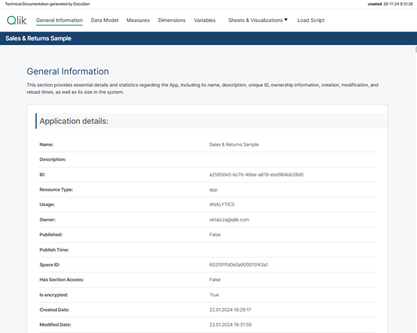
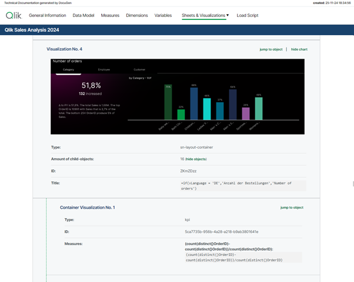
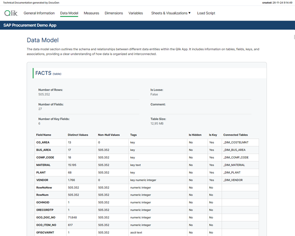
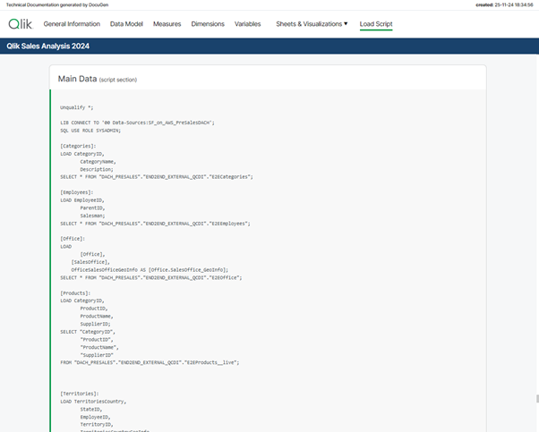

# DocuGen

Automatic generation of Qlik Sense app documentation thanks to Qlik Application Automation

##### [Download latest version](https://github.com/djaskowiak/DocuGen/releases)

#### Challenge:

Many of us are probably familiar with the fact that after a Qlik Sense app has been developed, documentation is required to transfer the analysis to production. This process is time-consuming and requires several days of work to finally obtain a "piece of paper". The documentation can be mandatory for both regulatory and operational reasons. Following the principle “Let's work smarter”, I would like to automate exactly this process with DocuGen using Qlik Application Automation (QAA). This can save valuable time and give us the ability to transfer use cases to production even faster.

##### Idea:

It all started with this simple idea and a first prototype, which I built in QAA. Various Qlik Cloud Services blocks are used to extract the relevant metadata from the individual app (e.g. table definitions, sheets and visualizations, variables, measures and dimensions, etc.). This data is then stored in variables and once all the information has been collected it gets passed into a “Custom Code” block. This block uses Python 3.11 and creates a dynamic HTML file without external references.  This means that the created HTML file remains transportable and does not require any external resources, as it contains all the necessary functions itself. Finally, the created HTML file is saved to MS Sharepoint.

##### Outcome:

This approach helps us to create standard documentation much faster daily (previously approx. 3 - 5 days; now ~ 30 minutes). In my day-to-day job as a BI Specialist, I am now able to transfer analysis prototypes to production much faster for my customers and deliver added value for the business departments even faster.  I think many other people in similar roles like me face the same challenge. This is the reason why I created a community project out of this idea together with Dennis Jaskowiak (Qlik PreSales). We started to extend the documentation with more functionalities, generalized the design of the documentation and reworked the code. In this article, we would like to share the project and its content with the Qlik Community.

#### Content of the package:

The archive consists of only 4 files:

 - [DocuGen v_(x)_.json _(x = version)_](https://github.com/djaskowiak/DocuGen/releases)
 - [code/custom_code_block.py](https://github.com/djaskowiak/DocuGen/blob/94227bf6e0df9077b56a13e1025b3794879e2388/code/custom_code_block.py)
 - [code/used_css.css](https://github.com/djaskowiak/DocuGen/blob/94227bf6e0df9077b56a13e1025b3794879e2388/code/used_css.css)
 - [code/used_js.js](https://github.com/djaskowiak/DocuGen/blob/94227bf6e0df9077b56a13e1025b3794879e2388/code/used_js.js)

To import the QAA you need the **DocuGen v(x).json** file. This file contains the exported QAA workspace.

The "code" folder contains the code segments used if you want to customise the code for your needs.

 - **custom_code_block.py**:
This file contains the code that we use in the `"Custom Code"` blog in the automation.

 - **used_css.css**:
This file contains the CSS definition that we use in the `"Variable - vCSS"` blog in the automation and imports the style description for our HTML file. The definition is not minified in this file.

 - **used_js.js**:
This file contains the Java scripts that we use in our Python script (custom_code_block.py at the very end). The JavaScript is implemented in the Python code (last `` section). It is important that `'{'` and `'}'` are replaced with `'{{'` and `'}}'` so that they are not evaluated in Python.

#### Installation:

 1. Create a new blank Qlik Application Automation
 2. Upload workspace *(right click on canvas)* à **DocuGen v_(x)_.json**
 3. Create a connection for SharePoint
	 a.  scroll to the bottom and click on the “**Create File on Microsoft SharePoint**” Block that has a red border
	 b.  click on the Connection tab and create a connection to your Microsoft SharePoint
	 c.  After you receive the information `“Connection is linked”` you can use it by clicking on your created connection. The connection tab should now change its colour from red to black.
 4. (_optional_) If you want to switch the **number format** from ‘comma’ to ‘point’ as decimal separator you can switch the value of the block named `“Variable – vNumber Format”` from `'de'` to `'us'`. It’s the second block of the automation.
 5. Now you can run the automation to generate your first documentation

#### Running the automation:

When you click on “Run” the automation gets executed. By default, the automation has configured “Run Mode: Manual”. It requires a few inputs for processing:

 - Space – where the app is located (_Personal doesn’t work_)
 - App name
 - List of Sections that need to be documented (e.g. Data Model, Measures, Dimensions etc.)
 - Screenshots (yes/no)
 - List for type of sheets (e.g. Public, Community, Private)

> [!NOTE]
> If you want to run the automation triggered (e.g. by REST call) it needs to me modified. We will post an example later to showcase this option.
  

#### Features:

This list showcases what DocuGen covers:

 - **General app information**:
	 - app name, description, Id, Resource type, type of usage, owner, published, published time, space Id, has section access, is encrypted, create date, modified date, last reload time, app memory footprint, app reload peak RAM

 - **Data model**:
	 - For every table it generates:
		 - title, number of rows, number of fields, number of key fields, is loose, comment, table size,
		 - table containing field name, number of distinct values, number of non-null values, tags, ishidden, iskey, connected tables

 - **Measures**:
	 - For every measure it generates:
		 - title, label, description, Id, definition, expression, grouping, custom formatted, format type, format, color, tags

 - **Dimensions**:
	 - For every dimension it generates:
		 - title, label, description, Id, definition, grouping, tags

 - **Variables**:
	- For every variable it generates:
		- title, Id, definition, comment, tags
		
- **Sheets & Visualizations**:
	- list of sheets
		- for every sheet it generates title, type, Id, description, grid resolution, sheet mode, list of used objects
		- link to sheet
	- list of objects on the sheet
		- for every object on a sheet, it generates screenshot, type, Id, title, subtitle, footnote, color mode, color definition, dimensions, measures, link to object
	- if the object is a container (layout container, tabbed container or normal container) it creates a list of all child objects containing the following information:
		- type, Id, title, subtitle, footnote, color mode, color definition, dimensions, measures, link to object
		
- **Load Script**:
	- For every script section it generates:
		- title, script

#### Closing:

This is it for now. I hope this community project can help you to also automize and minimize your documentation efforts. On the bottom of that article, you will find the necessary files. 
Link to  GitHub : [LINK](https://github.com/djaskowiak/DocuGen)
Link to Qlik Community article: LINK

This project has been created by [Prodromos Chatziagorakis](https://www.linkedin.com/in/prodromos-chatziagorakis-77111461/) & [Dennis Jaskowiak](https://www.linkedin.com/in/dennis-jaskowiak-7b01a31a7/)
